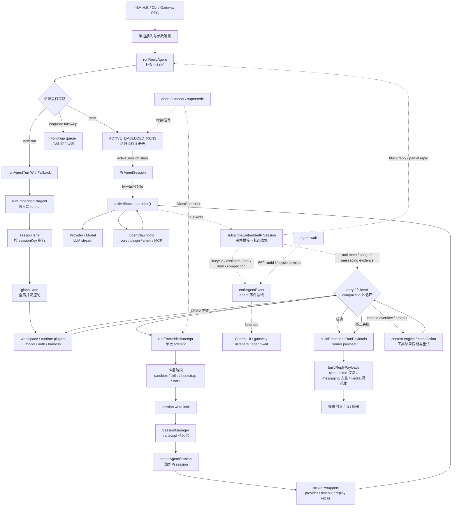

# Agent loop 技术架构

Agent loop 是 OpenClaw 把一次用户输入变成模型推理、工具调用、流式回复和会话持久化的核心运行链路。它不是单个循环函数，而是一组分层组件：渠道入口先组装一次回复运行，嵌入式 runner 负责队列、模型、认证和重试，attempt 层负责一次真实的 Pi agent 会话，订阅层把 Pi 事件桥接成 OpenClaw 的 agent 事件流。

本文基于当前代码实现整理，重点面向修改 agent 执行、工具生命周期、会话持久化、流式事件、compaction 或等待语义的维护者。

## 代码地图

核心实现位于这些文件：

- `src/auto-reply/reply/agent-runner.ts`：渠道消息进入 agent 的回复运行层，处理活跃运行、followup、steer、typing、block reply、最终 payload。
- `src/auto-reply/reply/agent-runner-execution.ts`：封装一次 agent turn 的执行和 fallback 入口。
- `src/agents/pi-embedded-runner/run.ts`：嵌入式 agent 运行器，负责 session/global lane、模型解析、认证 profile、fallback、retry、compaction retry 和最终结果组装。
- `src/agents/pi-embedded-runner/run/attempt.ts`：单次 attempt 的主体，创建 Pi `AgentSession`，装配工具、system prompt、stream wrapper、session lock，并调用 `activeSession.prompt()`。
- `src/agents/pi-embedded-subscribe.ts`：订阅 Pi agent 事件并收集 assistant 文本、tool meta、usage、compaction 状态和 messaging tool 证据。
- `src/agents/pi-embedded-subscribe.handlers.lifecycle.ts`：把 agent start/end 转成 `lifecycle` 事件。
- `src/agents/pi-embedded-subscribe.handlers.tools.ts`：把工具 start/update/end 转成 `tool`、`item`、`command_output`、`patch` 等事件，并触发 `after_tool_call`。
- `src/agents/pi-embedded-runner/runs.ts` 和 `src/agents/pi-embedded-runner/run-state.ts`：活跃运行注册、steer/followup 消息入队、abort、waiter 和模型切换状态。
- `src/agents/run-wait.ts`：客户端侧 `agent.wait` 等待封装。
- `src/infra/agent-events.ts`：OpenClaw agent 事件总线，维护 run 级 sequence、sessionKey 继承和 listener 通知。

已有英文概念页是 `docs/concepts/agent-loop.md`，本文补充实现视角。

## 总体分层

```text
渠道 / CLI / Gateway RPC
        |
        v
runReplyAgent
  - active run 策略
  - steer / followup / drop
  - typing 与 block reply
  - 最终 payload 整形
        |
        v
runAgentTurnWithFallback
        |
        v
runEmbeddedPiAgent
  - session lane + global lane
  - workspace / runtime plugin
  - before_model_resolve
  - model/auth/harness 解析
  - retry / failover / compaction 外循环
        |
        v
runEmbeddedAttempt
  - sandbox / skills / bootstrap
  - tool catalog / client tools / tool-search
  - session write lock + SessionManager
  - system prompt / stream wrapper
  - activeSession.prompt()
        |
        v
subscribeEmbeddedPiSession
  - assistant/tool/compaction/lifecycle 事件桥接
  - partial reply 与 block reply
  - tool meta、usage、messaging evidence 收集
```

这个分层的设计目标是把不同关注点隔离：

- 渠道层只决定这条消息如何进入正在运行或即将运行的 agent。
- runner 层只决定一次运行应该用哪个 workspace、provider、model、auth profile 和 retry/fallback 策略。
- attempt 层只负责把当前 transcript、prompt、工具和 transport 交给 Pi agent 执行。
- subscribe 层只负责把底层事件转换成 OpenClaw 可消费的事件和回复片段。

## 系统架构图

下面的图展示 agent-loop 的主执行链路、事件流、持久化面和控制面。实线表示一次 agent run 的主数据流，虚线表示事件、状态或控制信号。



## 入口与运行接收

Gateway RPC 和 CLI 的公共语义是：提交 agent 请求后尽快返回 `runId`，真实执行在运行队列中继续。渠道消息最终会走到 `runReplyAgent`。

`runReplyAgent` 的关键职责：

1. 根据 session 的队列策略判断当前消息是 `steer`、排队 followup、drop，还是立即启动新运行。
2. 如果已有流式运行且允许 steer，通过 `queueEmbeddedPiMessageWithOutcome()` 把新文本送进活跃 Pi session。
3. 创建 `ReplyOperation`，把运行后端 attach 到当前回复操作，支持 abort、supersede 和 still-shutting-down 保护。
4. 运行 preflight compaction 和 memory flush。
5. 调用 `runAgentTurnWithFallback()`，拿到 `runId`、`runResult`、fallback 尝试记录和 block reply 直接发送信息。
6. flush block reply 和 pending tool task，再用 `buildReplyPayloads()` 去掉 silent token、重复 messaging tool 文本、不可见 payload，形成最终回复。
7. 持久化 usage、fallback notice、compaction count，并发出 fallback 生命周期事件。

这意味着渠道侧不直接操作 Pi session。活跃运行的消息注入通过 `ACTIVE_EMBEDDED_RUNS` 中注册的 queue handle 完成。

## 队列与并发模型

`runEmbeddedPiAgent` 在进入真实执行前会解析两个 lane：

- session lane：`resolveSessionLane(sessionKey || sessionId)`，确保同一会话串行执行。
- global lane：`resolveGlobalLane(lane)`，默认是 main lane；cron lane 会映射为 nested lane 以避免内层调用死锁。

执行顺序是先进入 session lane，再进入 global lane。这样可以同时满足两类约束：

- 同一 session 的 transcript、工具结果、compaction 和 final reply 不互相踩踏。
- 全局运行量仍受共享 lane 控制，不让大量 session 同时压垮本地运行时。

会话文件还有第二层保护：`runEmbeddedAttempt` 在打开并修改 `SessionManager` 前获取 session write lock。锁只覆盖 transcript/session mutation，不覆盖冷启动、工具构造等慢操作，避免一个卡在启动阶段的 gateway run 阻塞 CLI fallback 接管同一 session。

## 嵌入式 runner 生命周期

`runEmbeddedPiAgent` 是外层运行器。它的生命周期可以概括为：

1. 回填和标准化 `sessionKey`，创建 workspace。
2. 加载 runtime plugins。
3. 构造 hook context，先运行 `before_agent_reply` 的 cron 特例，再运行 `before_model_resolve`。
4. 选择 agent harness。默认是 Pi harness；插件 harness 可以拥有自己的 transport。
5. 解析 model、context window、auth storage、auth profile 顺序。
6. 创建 retry 状态：usage accumulator、idle-timeout breaker、post-compaction loop guard、fallback decision logger。
7. 进入 `while (true)` 尝试循环。
8. 每轮调用 `runEmbeddedAttemptWithBackend()`。
9. 根据 attempt 结果决定成功返回、同模型重试、auth profile 轮换、fallback model、compaction 后重试，或向调用方抛错。

runner 外循环处理的主要恢复路径：

- 模型或 provider 失败：按 failover policy 旋转 profile 或 fallback model。
- idle timeout：有限次重试，并由 idle-timeout breaker 防止连续付费空转。
- context overflow：触发 context engine compaction 或工具结果截断，然后重试。
- timeout 且 prompt token 占比较高：先尝试 timeout-triggered compaction。
- compaction 已发生但没有最终可见回复：追加 continuation 指令再重试一次。
- live session model switch：当当前 attempt 尚未产生副作用时，抛出 `LiveSessionModelSwitchError` 让外层用新模型重启。
- post-compaction 工具重复：post-compaction loop guard 可以中止仍在重复的工具循环。

runner 返回的是 `EmbeddedPiRunResult`，其中包括 payloads、usage、agentMeta、messaging tool 发送证据、compaction count、livenessState 等。

## Attempt 层：一次真实 Pi agent 会话

`runEmbeddedAttempt` 是实际模型和工具交互发生的地方。它的执行分为准备、session 创建、prompt 提交、收尾四段。

### 准备阶段

准备阶段完成这些工作：

- 解析 sandbox。只读或隔离 sandbox 会改变 effective workspace。
- 解析当前 agent id、filesystem policy、skills snapshot，并把 skill env 注入本轮环境。
- 构造 OpenClaw 工具：核心工具、插件工具、bundle MCP/LSP 工具、client tools。
- 应用 `tools.allow`、sandbox tool policy、subagent tool policy 和 tool-search compact catalog。
- 解析 bootstrap/context files，运行 `agent:bootstrap` 相关逻辑，生成 system prompt report。
- 构造初始 system prompt，包括 base prompt、skills prompt、bootstrap context、model identity、runtime context。

工具构造发生在 session lock 之前，这是性能和可恢复性的关键点。

### SessionManager 与 Pi AgentSession

拿到 session lock 后，attempt 会：

- 修复损坏的 session file。
- 打开 `SessionManager.open(sessionFile)`，再用 `guardSessionManager()` 包装。
- 运行 context engine bootstrap 和 maintenance。
- 调用 `prepareSessionManagerForRun()`，准备 cwd/sessionId 等 Pi session 状态。
- 创建 settings manager、resource loader 和 compaction guard。
- 调用 `createAgentSession()` 创建 Pi `AgentSession`。
- 把 OpenClaw 生成的 system prompt override 写入 session。

之后，attempt 会安装多个运行期 guard 和 transform：

- tool result context guard：在工具循环中提前发现上下文溢出风险。
- context engine loop hook：当 context engine 拥有 compaction 时，接管 after-turn 维护。
- history image prune transform。
- prompt cache trace。
- provider stream wrapper：注入 provider stream、extra params、timeout、diagnostic model-call events。
- transcript replay 修复：reasoning/thinking block、tool call id、tool-use/tool-result pairing、OpenAI Responses 特定修复。
- malformed tool call 名称和参数修复。

### Prompt 提交与事件订阅

在调用 `activeSession.prompt()` 前，attempt 会创建 `subscribeEmbeddedPiSession()` 订阅，并注册 active run queue handle：

- `queueMessage()` 调用 `activeSession.steer(text)`，支持运行中 steer。
- `isStreaming()` 返回 Pi session 当前 streaming 状态。
- `isCompacting()` 读取订阅层 compaction 状态。
- `abort()` 同时 abort run controller、compaction 和 active session。

订阅建立后，attempt 执行 prompt 提交：

- 运行 `before_prompt_build` 和 legacy `before_agent_start`，允许插件追加 prompt/system context。
- 运行 `before_agent_run`，可以在 prompt 前阻断并持久化一条 redacted user message。
- 修复 orphan trailing user message，避免连续 user turn 破坏 provider 角色顺序。
- 注入 current turn context、runtime-only context 和 transcript prompt。
- 调用 `activeSession.prompt(promptForModel, options)`。

Pi agent 在 `prompt()` 内部完成模型流式输出、工具调用、工具结果写回、必要的内部 retry/compaction。OpenClaw 通过订阅层观察这些事件。

### 收尾阶段

prompt 返回或异常后，attempt 会：

- 等待 compaction retry 或在 aggregate timeout 后使用可用 snapshot。
- 选择当前 messages snapshot，必要时使用 compaction 前快照。
- 提取当前 attempt 的 assistant、usage、prompt cache 信息。
- 记录 prompt error custom entry。
- 运行 context engine after-turn/finalize。
- 自动 compaction 后可选择 rotate transcript。
- 异步运行 `agent_end` 和 `llm_output` hook。
- 清理 active run、unsubscribe、detach reply backend、flush trajectory、flush pending tool results、释放 session lock。

attempt 的返回值不是最终用户回复，而是 runner 继续做重试、fallback 和 payload 组装所需的结构化事实。

## 事件流模型

OpenClaw 的 agent 事件由 `emitAgentEvent()` 发出。事件包含：

- `runId`
- 单 run 内递增的 `seq`
- `stream`
- `ts`
- `data`
- 可继承的 `sessionKey`

当前 agent-loop 主要使用这些 stream：

- `lifecycle`：`start`、`end`、`error`、fallback 相关 phase。
- `assistant`：assistant delta 或块级回复进度。
- `tool`：工具 start/update/end。
- `item`：UI 可展示的结构化 item，例如 tool、command、patch。
- `command_output`：exec/bash 的输出增量和结束状态。
- `patch`：apply_patch 结果摘要。
- `compaction`：compaction start/end 和 retry 进度。
- `thinking`：推理流。

`subscribeEmbeddedPiSession` 负责把 Pi 事件映射到这些 stream：

- `agent_start` -> `lifecycle.start`
- assistant text delta -> assistant stream、block reply、partial reply
- `tool_execution_start/update/end` -> tool/item/command_output/patch 事件
- `compaction_start/end` -> compaction 事件和 compaction wait promise
- `agent_end` -> `lifecycle.end` 或 `lifecycle.error`

终端 lifecycle 事件发出前会调用 `onBeforeLifecycleTerminal`。attempt 用这个钩子先清理 active embedded run，这样 terminal 事件消费者不会把逻辑上已结束的 run 误判为仍活跃。

## 工具调用生命周期

工具生命周期由两部分组成：

- attempt 层把 OpenClaw 工具、插件工具、client tools 和 bundle tools 注册进 Pi session。
- subscribe tools handler 观察每次工具执行的 start/update/end。

工具 start 时会：

- 标记 `tool_execution_started` execution phase。
- 记录开始时间和原始 args，供 `after_tool_call` 使用。
- 推送 `tool` stream start 事件。
- 推送 `item` stream start 事件。
- 对 exec/bash 额外推送 command item。
- 对 apply_patch 额外推送 patch item。
- 对 messaging tools 记录 pending text、target、media。

工具 end 时会：

- 判断是否 error。
- 提取、截断和清洗 tool result。
- 提交 messaging tool 发送证据，只有成功发送后才用于最终回复去重。
- 推送 `tool` stream end 事件。
- 更新 item、command、patch 结束状态。
- 异步运行 `after_tool_call`。

`before_tool_call` 不是在 subscribe handler 里直接实现，而是在工具执行管线中运行；它可以 block 工具调用，也会接入 tool loop detection。critical loop 会阻断下一次工具循环。

## 回复构造与去重

agent-loop 中有三种回复路径：

- 流式 block reply：assistant delta 按 `text_end` 或 `message_end` 分块直接发送到渠道。
- partial reply：适合 UI 或中间态消费者。
- final payload：run 完成后由 `buildReplyPayloads()` 汇总发送。

最终 payload 会被整形：

- 过滤精确 silent token：`NO_REPLY` / `no_reply`。
- 去掉 messaging tool 已经成功发送过的重复文本或媒体。
- 按 reply threading / reply-to mode 调整投递方式。
- 将本地媒体路径规范化为渠道可用 payload。
- 如果没有可见 payload，则返回 `undefined`，不再发空消息。
- 如果工具失败且没有用户可见回复，可能生成 fallback tool error reply。

这个设计避免模型在调用消息发送工具后，又用最终 assistant 文本重复通知用户。

## Compaction 与上下文恢复

agent-loop 有多层上下文保护：

- prompt 前 preflight compaction。
- attempt 内 tool result context guard。
- context engine assemble/windowing。
- Pi auto-compaction guard。
- runner 外层 context overflow compaction retry。
- timeout-triggered compaction。
- post-compaction loop guard。

当 compaction 发生时，订阅层会维护 `compactionInFlight`、`pendingCompactionRetry` 和 `compactionRetryPromise`。attempt 在 prompt 返回后会等待 compaction retry 完成；如果等待超时，会选择可用的 pre-compaction 或当前 snapshot，避免因为 compaction 超时丢失已完成的消息状态。

当 context engine 拥有 compaction 时，OpenClaw 不直接调用旧的 Pi compaction 路径，而是在 runner 和 attempt 的 context engine hooks 中触发 before/after compaction 兼容事件，保持插件观察面一致。

## Hook 面

agent-loop 相关 hook 的位置如下：

- `before_model_resolve`：runner 早期执行，尚未加载 session messages，用于确定性改写 provider/model。
- `before_agent_reply`：cron 特例可在进入模型前直接 handled。
- `agent:bootstrap`：attempt 构建 bootstrap context 时影响上下文文件。
- `before_prompt_build`：attempt 已加载 session messages 后执行，可注入 prompt/system context。
- `before_agent_start`：legacy 兼容入口，部分语义被映射到 model resolve 或 prompt build 阶段。
- `before_agent_run`：prompt 提交前执行，可阻断本轮。
- `before_tool_call`：工具执行前执行，可审批、改写或阻断工具。
- `after_tool_call`：工具结束后异步执行，带结果、耗时和调整后的 args。
- `before_compaction` / `after_compaction`：compaction 前后执行。
- `agent_end`：attempt 完成后异步执行，包含 messages、success/error、duration。
- `llm_output`：attempt 输出完成后异步执行，包含 assistantTexts 和 usage。

新增 hook 时应先判断属于 runner 级事实、attempt 级 transcript/tool 事实，还是 subscribe 级事件事实，避免在热路径里重新加载插件/渠道运行时。

## 等待语义

`agent.wait` 等待的是指定 `runId` 的 terminal lifecycle 结果，不是轮询 transcript。客户端封装在 `waitForAgentRun()` 中：

- 返回 `ok`、`error`、`timeout` 或 `pending`。
- `timeoutMs` 只限制等待方，不会停止正在运行的 agent。
- 网络断开、gateway close 等可恢复错误会被上层 drain 逻辑视为可重试条件。

子 agent 或 followup drain 使用 `waitForAgentRunsToDrain()`。它会循环刷新 pending run ids，因为一个 run 结束时可能又派生新 run。

## 失败与保护机制

agent-loop 的失败保护分布在不同层：

- Reply 层：active run 策略、still-shutting-down 保护、block reply flush timeout。
- Runner 层：最大 retry 次数、fallback decision、auth profile cooldown、idle-timeout breaker、live model switch 安全重启。
- Attempt 层：session write lock、run timeout、model idle timeout、compaction grace、tool result context guard、transcript replay 修复。
- Subscribe 层：terminal lifecycle once、compaction wait reject、messaging evidence 只在工具成功后提交。
- Tool 层：before-tool-call block、approval、tool loop detection、unknown tool guard。
- Event 层：run context TTL sweep，避免 orphaned event context 长期留存。

这些保护的共同原则是：有副作用后不要静默重放；无法确认 transcript 安全时标记 replay invalid 或 abandoned；等待超时不等于运行取消。

## 维护建议

修改 agent-loop 时优先遵守这些边界：

- 需要改变排队、steer、followup 行为时，优先看 `runReplyAgent` 和 `runs.ts`，不要在 attempt 内绕过 queue handle。
- 需要改变模型选择、auth、fallback、retry 时，优先改 `runEmbeddedPiAgent`。
- 需要改变 prompt、工具、session transcript、compaction 和 stream wrapper 时，优先改 `runEmbeddedAttempt`。
- 需要改变 UI/渠道实时进度或 tool event 形状时，优先改 subscribe handlers。
- 涉及 transcript 写入必须尊重 session write lock 和 `SessionManager` guard。
- 涉及 provider 行为必须先确认 provider transport/source/types，不要猜默认错误、超时或 tool-call 格式。
- 新事件应通过 `emitAgentEvent()` 发出，并考虑 hidden control UI run 的 sessionKey 暴露规则。
- 新的运行事实应尽量在上游准备后向下传递，不要在工具热路径或每次请求中重新做广泛 discovery。

## 相关文档

- `docs/concepts/agent-loop.md`
- `docs/concepts/compaction.md`
- `docs/concepts/streaming.md`
- `docs/tools/loop-detection.md`
- `docs/concepts/system-prompt.md`
