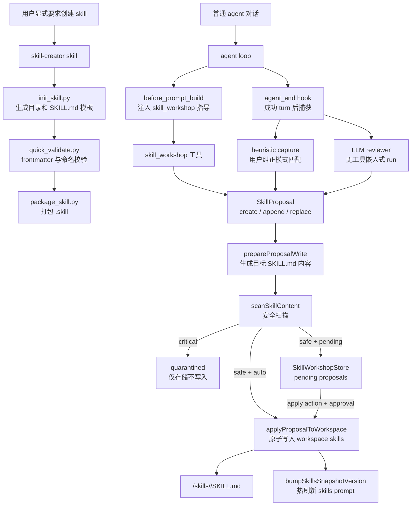

# Skill-create 实现架构

OpenClaw 里没有一个单独名为 `skill-create` 的核心子系统。当前“创建 skill”的能力由两条实现线组成：

- `skills/skill-creator`：一个内置 skill，指导 agent 或维护者创建 `SKILL.md`，并提供 Python 脚手架、校验和打包脚本。
- `extensions/skill-workshop`：一个实验性插件，向 agent 暴露 `skill_workshop` 工具，把对话中学到的可复用流程转成 workspace skill proposal，并在审核后写入 `<workspace>/skills/<skill-name>/SKILL.md`。

这两条线服务不同场景：`skill-creator` 面向显式创建和发布；`skill-workshop` 面向运行期把成功经验、用户纠正和重复流程沉淀为 workspace skill。

## 代码地图

手工/脚手架创建：

- `skills/skill-creator/SKILL.md`：skill 创建方法论，定义 skill 结构、渐进披露、资源目录和创建流程。
- `skills/skill-creator/scripts/init_skill.py`：生成 skill 目录、`SKILL.md` 模板和可选 `scripts/`、`references/`、`assets/` 示例。
- `skills/skill-creator/scripts/quick_validate.py`：校验 `SKILL.md` frontmatter、name、description 和允许字段。
- `skills/skill-creator/scripts/package_skill.py`：运行校验后把 skill 目录打包成 `.skill` zip，跳过 symlink 和常见大目录。

运行期自动创建：

- `extensions/skill-workshop/openclaw.plugin.json`：插件 manifest，声明 `skill_workshop` 工具和配置 schema。
- `extensions/skill-workshop/index.ts`：插件注册入口，注册工具、trusted tool policy、`before_prompt_build` 和 `agent_end` hooks。
- `extensions/skill-workshop/src/tool.ts`：`skill_workshop` 工具实现，支持 status/list/inspect/suggest/apply/reject/write_support_file。
- `extensions/skill-workshop/src/workshop.ts`：proposal 的 apply-or-store 决策。
- `extensions/skill-workshop/src/store.ts`：proposal 私有状态存储和 review 计数器。
- `extensions/skill-workshop/src/skills.ts`：skill 文件生成、append/replace、路径约束、原子写入和 snapshot bump。
- `extensions/skill-workshop/src/scanner.ts`：生成内容安全扫描。
- `extensions/skill-workshop/src/signals.ts`：启发式捕获用户纠正。
- `extensions/skill-workshop/src/reviewer.ts`：LLM reviewer，把 transcript 和现有 skills 变成 JSON proposal。
- `extensions/skill-workshop/src/prompt.ts`：注入给 agent 的简短使用指导。

相关文档：

- `docs/tools/creating-skills.md`
- `docs/tools/skills.md`
- `docs/plugins/skill-workshop.md`
- `docs/plugins/reference/skill-workshop.md`

## 总体架构



## Skill 数据模型

OpenClaw skill 的最小单位是一个目录：

```text
skill-name/
├── SKILL.md
├── scripts/
├── references/
└── assets/
```

`SKILL.md` 必须包含 YAML frontmatter：

```markdown
---
name: skill-name
description: 说明何时使用这个 skill 的一句话
---
```

运行时加载和触发主要依赖 frontmatter 的 `name` 和 `description`。body 只在 skill 被触发后进入上下文。`scripts/`、`references/`、`assets/` 是渐进披露资源：脚本可直接执行，references 按需读取，assets 用于输出产物而不是默认塞进上下文。

## 手工创建路径：skill-creator

`skills/skill-creator/SKILL.md` 本身是一个指导型 skill。它不直接接管 OpenClaw 核心运行时，而是告诉 agent 如何设计、创建、验证和打包一个 skill。

创建流程：

1. 明确 skill 的触发场景和具体例子。
2. 判断是否需要 `scripts/`、`references/` 或 `assets/`。
3. 用 `init_skill.py` 初始化目录和模板。
4. 编辑 `SKILL.md` 和资源文件。
5. 用 `quick_validate.py` 校验结构。
6. 用 `package_skill.py` 打包 `.skill`。
7. 根据真实使用反馈迭代。

`init_skill.py` 的实现要点：

- 将输入名称规范化为小写 hyphen-case。
- 限制 skill name 最大 64 字符。
- 支持 `--resources scripts,references,assets` 创建资源目录。
- 支持 `--examples` 生成示例脚本、引用文档和资产占位文件。
- 如果目标目录已存在，直接失败，避免覆盖已有 skill。

`quick_validate.py` 的实现要点：

- 读取 `SKILL.md` 并提取 `---` frontmatter。
- 优先用 PyYAML 解析；没有 PyYAML 时使用简单 key-value fallback parser。
- 只允许 `name`、`description`、`license`、`allowed-tools`、`metadata`。
- 要求 `name` 和 `description` 存在。
- `name` 必须是 lowercase letters、digits、hyphens，不能以 hyphen 开头或结尾，不能包含连续 hyphen。
- `description` 必须是字符串，不能包含尖括号，最大 1024 字符。

`package_skill.py` 的实现要点：

- 打包前先调用 `validate_skill()`。
- 输出 `.skill` 文件，本质是 zip。
- archive 内部以 skill 目录名作为根。
- 跳过 symlink，避免把 skill 根外文件打包进去。
- 排除 `.git`、`.svn`、`.hg`、`__pycache__`、`node_modules`。
- 如果输出 archive 位于 skill 目录内，会跳过 archive 本身，避免自包含。

## 运行期创建路径：skill-workshop

Skill Workshop 是插件实现，默认实验性、未默认启用。启用后，它向 agent loop 接入四个面：

- 工具面：注册 `skill_workshop`。
- 策略面：对 `skill_workshop.apply` 注册 trusted tool policy，pending 模式下需要 operator approval。
- Prompt 面：在 `before_prompt_build` 注入 `<skill_workshop>` 指导，提醒 agent 只捕获可复用流程。
- Turn 结束面：在 `agent_end` 后根据配置自动捕获 proposal。

插件配置来自 live plugin config，入口在 `index.ts` 中通过 `resolveLivePluginConfigObject()` 读取，因此运行时配置变更会影响后续工具和 hook 行为。

## skill_workshop 工具

`createSkillWorkshopTool()` 定义工具 schema 和执行分支。工具参数里 `action` 支持：

- `status`：统计 pending、quarantined、applied、rejected 数量。
- `list_pending`：列出 pending proposal。
- `list_quarantine`：列出 quarantined proposal。
- `inspect`：按 id 查看 proposal。
- `suggest`：从工具参数构造 proposal，并按策略存储或应用。
- `apply`：应用已存在 proposal。
- `reject`：把 proposal 标记为 rejected。
- `write_support_file`：写入某个 skill 的支持文件。

`suggest` 会调用 `buildProposal()`。proposal 的 change 类型由参数决定：

- `oldText` + `newText`：生成 `replace`。
- `section` + `body`：生成 `append`。
- 只有 `body`：生成 `create`。

`write_support_file` 只能写入 skill 目录下的固定支持目录：

- `references`
- `templates`
- `scripts`
- `assets`

它拒绝 `.`、`..`，并用 `resolvePathWithinRoot()` 确保路径不能逃逸 skill 目录。

## Proposal 生命周期

Skill Workshop 的核心中间态是 `SkillProposal`：

```ts
type SkillProposal = {
  id: string;
  createdAt: number;
  updatedAt: number;
  workspaceDir: string;
  agentId?: string;
  sessionId?: string;
  skillName: string;
  title: string;
  reason: string;
  source: "agent_end" | "reviewer" | "tool";
  status: "pending" | "applied" | "rejected" | "quarantined";
  change: SkillChange;
  scanFindings?: SkillScanFinding[];
  quarantineReason?: string;
};
```

`SkillChange` 有三种：

- `create`：创建新 `SKILL.md`，如果文件已存在则追加到 `## Workflow`。
- `append`：追加到指定 section；如果 skill 不存在，先创建最小 skill。
- `replace`：在现有 skill 中把 `oldText` 替换成 `newText`。

proposal 的落地由 `applyOrStoreProposal()` 决定：

1. 调用 `prepareProposalWrite()` 生成目标文件内容。
2. 对生成内容运行 `scanSkillContent()`。
3. 如果有 critical finding，存为 `quarantined`。
4. 如果配置是 `approvalPolicy: "auto"` 且没有 `skipAutoApply`，写入 workspace 并存为 `applied`。
5. 否则存为 `pending`，等待 apply。

## 存储模型

`SkillWorkshopStore` 使用插件私有状态目录保存 proposal：

```text
<stateDir>/skill-workshop/<workspace-hash>.json
```

workspace hash 是 workspace 绝对路径的 SHA-256 前 16 位。这样每个 workspace 的 proposals 和 reviewer 计数隔离。

store 文件结构：

```ts
{
  version: 1,
  proposals: SkillProposal[],
  review?: {
    turnsSinceReview: number,
    toolCallsSinceReview: number,
    lastReviewAt?: number
  }
}
```

存储层使用进程内 lock 串行同一个 store 文件的读改写。新增 proposal 时会做重复检测：如果已有 pending/quarantined proposal 的 `skillName` 和 `change` 完全相同，直接返回旧 proposal。`maxPending` 用于限制 pending/quarantined 队列长度，旧项会被裁掉。

## 写入与刷新

实际文件写入在 `extensions/skill-workshop/src/skills.ts`。

写入路径固定在：

```text
<workspace>/skills/<skill-name>/SKILL.md
```

关键安全约束：

- `skillName` 会被 `normalizeSkillName()` 规范化，再由 `assertValidSkillName()` 校验。
- skill 根目录通过 `resolvePathWithinRoot()` 约束在 `<workspace>/skills` 内。
- `maxSkillBytes` 限制生成后的 skill 内容大小。
- 写入前再次运行 `assertSkillContentSafe()`。
- 使用 `replaceFileAtomic()` 原子替换文件，临时文件前缀是 `.skill-workshop`。
- 写入成功后调用 `bumpSkillsSnapshotVersion()`，让后续运行能刷新 skills prompt。

`appendSection()` 会避免重复追加完全相同的 body；如果目标 heading 不存在，则在文件末尾创建 `## <section>`。

## 自动捕获：heuristic

`signals.ts` 实现了轻量启发式捕获。它只扫描成功 turn 中的 user 文本，并寻找明确纠正或未来流程指令：

- `next time`
- `from now on`
- `remember to`
- `make sure to`
- `always ... use/check/verify/record/save/prefer`
- `prefer ... when/for/instead/use`
- `when asked`

匹配到后，`inferTopic()` 根据关键词选择 skill：

- animated/GIF -> `animated-gif-workflow`
- screenshot/asset -> `screenshot-asset-workflow`
- QA/scenario/test plan -> `qa-scenario-workflow`
- PR/GitHub -> `github-pr-workflow`
- fallback -> `learned-workflows`

生成的 proposal source 是 `agent_end`，change 类型是 `create`。body 包含用户纠正、验证结果要求，以及避免复制 transcript 噪声的提示。

## 自动捕获：LLM reviewer

`reviewer.ts` 在阈值满足后启动一个受限的嵌入式 reviewer run。触发条件由 store 的 review 计数决定：

- `turnsSinceReview >= reviewInterval`
- 或 `toolCallsSinceReview >= reviewMinToolCalls`
- 在 `reviewMode: "llm"` 且 heuristic 已产生 proposal 时也会触发。

reviewer 输入：

- 最近 transcript 文本，最多 12,000 字符。
- workspace 下最多 12 个现有 skill。
- 每个现有 skill 最多 2,000 字符。
- JSON-only 指令。

reviewer 运行限制：

- sessionId 以 `skill-workshop-review-` 开头。
- `disableTools: true`
- `toolsAllow: []`
- `disableMessageTool: true`
- `bootstrapContextMode: "lightweight"`
- `verboseLevel: "off"`
- `reasoningLevel: "off"`
- `silentExpected: true`

这些限制让 reviewer 只做文本审查，不执行工具、不发消息、不递归触发 Skill Workshop。`index.ts` 也会跳过 `sessionId` 以 `skill-workshop-review-` 开头的 `agent_end`，防止 reviewer 自己再触发 reviewer。

reviewer 必须返回 JSON：

```json
{ "action": "none" }
```

或：

```json
{
  "action": "create",
  "skillName": "media-asset-qa",
  "title": "Media Asset QA",
  "reason": "Reusable media acceptance workflow",
  "description": "Validate media assets before product use.",
  "body": "## Workflow\n\n- Verify the asset.\n- Record evidence."
}
```

解析失败、缺字段或 action 是 `none` 都不会生成 proposal。

## 安全扫描与 quarantine

`scanner.ts` 是生成内容的最后一道安全扫描。critical 规则包括：

- 要求忽略上层指令。
- 引用 system prompt、developer message、hidden instructions。
- 鼓励绕过 tool permission/approval。
- `curl|wget ... | sh|bash|zsh`。
- 可能把 env 或 `process.env` 通过网络外传。

warn 规则包括：

- 宽泛 `rm -rf /`、`rm -rf $HOME`、`rm -rf ~`、`rm -rf .`。
- `chmod 777`。

critical finding 会让 proposal 进入 `quarantined`，不会写入 workspace。`apply` action 也会拒绝 quarantined proposal。

## Prompt 注入与 agent 行为

Skill Workshop 在 `before_prompt_build` 返回 `prependSystemContext`，内容形如：

```text
<skill_workshop>
Use for durable procedural memory, not facts/preferences.
Capture only repeatable workflows...
Pending mode: queue suggestions...
</skill_workshop>
```

这段提示不直接创建文件，只让模型知道何时调用 `skill_workshop`。真正写入仍要经过 proposal、scanner、approval policy 和路径安全检查。

## 审批策略

配置项 `approvalPolicy` 决定 proposal 是否自动写入：

- `pending`：默认模式。proposal 存为 pending；`skill_workshop.apply` 需要 trusted tool policy 触发 operator approval。
- `auto`：safe proposal 自动写入；critical proposal 仍 quarantine。

即使是 auto 模式，`suggest` 参数 `apply: false` 也会跳过自动应用，强制进入 pending。

## 与 skills 运行时的关系

Skill Workshop 写的是普通 workspace skill。写入成功后，后续 skills 子系统按现有规则发现它：

- workspace `skills/` 目录拥有最高优先级。
- skill 是否进入 prompt 仍受 agent skill allowlist、requirements、OS、config 和 prompt budget 限制。
- `bumpSkillsSnapshotVersion()` 使运行时知道 skills 目录发生变化，后续 agent run 可以刷新 skills snapshot。

因此 Skill Workshop 不绕过 skills 加载系统；它只生产符合现有约定的 `SKILL.md` 文件。

## 维护边界

修改 skill-create 相关能力时建议按边界定位：

- 改手工创建模板或打包规则：看 `skills/skill-creator/scripts/*`。
- 改运行期工具参数或 action：看 `extensions/skill-workshop/src/tool.ts`。
- 改 proposal 生命周期：看 `workshop.ts` 和 `store.ts`。
- 改写入格式、append/replace 语义或路径安全：看 `skills.ts`。
- 改安全规则：看 `scanner.ts`。
- 改自动捕获关键词：看 `signals.ts`。
- 改 reviewer prompt、输入限制或模型运行参数：看 `reviewer.ts`。
- 改 agent 何时知道 `skill_workshop`：看 `prompt.ts` 和 `index.ts` 的 `before_prompt_build` hook。

不要让 Skill Workshop 直接写 workspace 任意路径，也不要绕过 scanner、approval policy 或 `bumpSkillsSnapshotVersion()`。这三个点分别保护路径边界、内容安全和运行时可见性。
